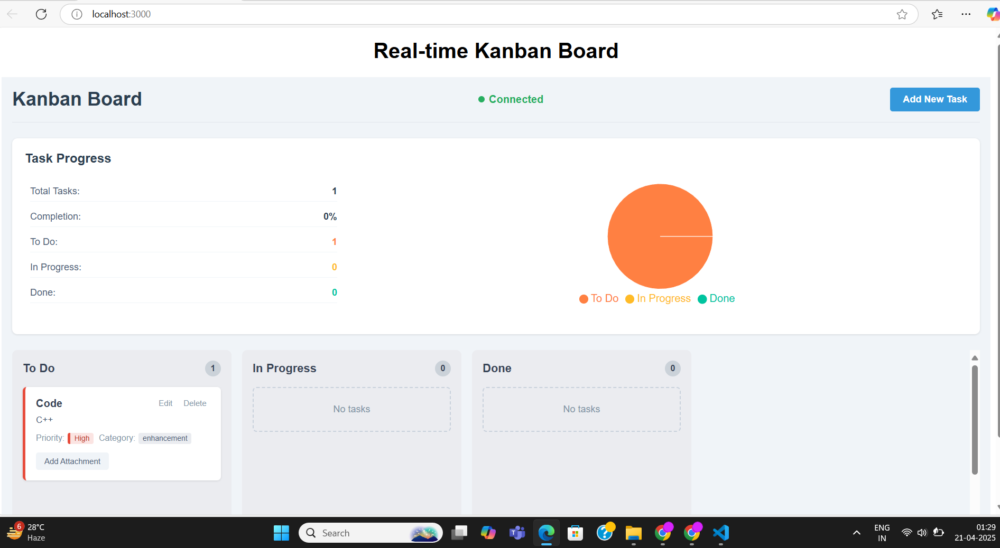

# 📝 WebSocket-Powered Kanban Board

A real-time Kanban board built with **React**, **Node.js**, **Socket.IO**, **Vitest**, and **Playwright**. This project supports real-time task updates, drag-and-drop functionality, task categorization, attachment uploads, and dynamic progress visualization.

## 🚀 Features

- ✅ Real-time sync with **WebSockets (Socket.IO)**
- ✅ **Draggable Kanban board** (To Do, In Progress, Done)
- ✅ **Task CRUD operations** (Create, Read, Update, Delete)
- ✅ Assign **Priority** (Low, Medium, High) & **Category** (Bug, Feature, Enhancement)
- ✅ **File attachments** with preview (image/PDF)
- ✅ Live **progress visualization** using charts
- ✅ Fully **tested** using:
  - 🧪 Vitest + React Testing Library (unit & integration tests)
  - 🎭 Playwright (E2E tests)

---

## 🏗️ Project Structure

```
websocket-kanban-vitest-playwright/
│
├── backend/                     # WebSocket server
│   ├── server.js                # Express + Socket.IO setup
│   └── package.json
│
├── frontend/                    # React frontend
│   ├── src/
│   │   ├── components/          # All UI components
│   │   ├── tests/
│   │   │   ├── unit/            # Unit tests (Vitest)
│   │   │   ├── integration/     # Integration tests (Vitest)
│   │   │   ├── e2e/             # E2E tests (Playwright)
│   └── package.json
│
└── README.md
```

---

## 🔌 Backend – Node.js + Socket.IO

- WebSocket event handling for:
  - `task:create` – Add new task
  - `task:update` – Edit task (title, description, priority, etc.)
  - `task:move` – Move task between columns
  - `task:delete` – Delete task
  - `sync:tasks` – Sync existing tasks to new clients
- In-memory data structure (can be switched to MongoDB)

---

## 💻 Frontend – React + WebSocket

- **Kanban Board UI**:
  - Columns: To Do, In Progress, Done
  - Tasks draggable between columns using `React DnD`
  - Sync in real-time with backend
- **Task Features**:
  - Priority & Category via `react-select`
  - File Upload with image preview
- **Graph View**:
  - Built with `Chart.js`
  - Real-time progress visualization

---

## ✅ Testing Strategy

### 🧪 Unit & Integration Tests – Vitest + React Testing Library
- Covered logic:
  - Task creation, deletion, updates
  - WebSocket communication
  - Drag-and-drop task movement

### 🎭 End-to-End Tests – Playwright
- Functional tests for:
  - Task operations (add, move, delete)
  - File uploads & validation
  - Dropdown selections (priority/category)
  - Real-time UI sync between sessions
  - Graph updates and re-rendering

---

## 📦 Installation

```bash
# Clone repo
git clone https://github.com/yourusername/websocket-kanban-vitest-playwright
cd websocket-kanban-vitest-playwright

# Start backend
cd backend
npm install
node server.js

# Start frontend
cd ../frontend
npm install
npm run dev
```

---

## 🧪 Run Tests

```bash
# Run unit & integration tests
cd frontend
npm run test

# Run Playwright E2E tests
npx playwright install
npm run e2e
```

---

## 📊 Tech Stack

- **Frontend**: React, React DnD, React Select, Chart.js
- **Backend**: Node.js, Express, Socket.IO
- **Testing**: Vitest, React Testing Library, Playwright

---

## 📸 Screenshots


## 🧠 Learnings

- Deepened understanding of real-time data flow with WebSockets.
- Implemented test-driven development with comprehensive coverage.
- Enhanced UI/UX using modern libraries and design patterns.

---

## 🙌 Acknowledgements

- Inspired by tools like Trello, Jira, and ClickUp
- Libraries: Socket.IO, React DnD, Chart.js, Playwright, Vitest

---

## 👤 Author

**Om**  
📧 ombhayde5@gmail.com

